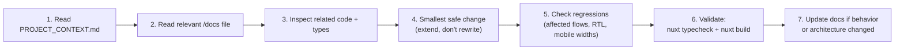

# AI Development Guide — Artivo

> **Read this before writing any code.** Then read [`PROJECT_CONTEXT.md`](./PROJECT_CONTEXT.md) and the relevant [`/docs/*`](./docs) file for the area you touch.
> Companion primary doc: [`PROJECT_CONTEXT.md`](./PROJECT_CONTEXT.md) · Status labels used everywhere: ✅ Implemented · 🟡 Partial · 🔜 Planned

**Last Updated:** 2026-08-27

---

## 0. The Five Unbreakable Rules

1. **Preserve RTL.** The whole UI is Persian RTL. Use CSS logical properties (`margin-inline`, `inset-inline-start`); never physical `left/right`; never reintroduce the invalid `@media (direction: rtl)`.
2. **Preserve mobile-first.** Every change must survive **320–430 px**. Fixed elements must respect the bottom-nav offset (`5.2rem + safe-area`) and `env(safe-area-inset-*)`.
3. **Don't touch the design system without explicit instruction.** Tokens live in `app/assets/css/main.css`; components in `app/components/ui/`. Extend, don't restyle. **Light mode only — no dark mode.**
4. **No hardcoded secrets, ever.** All keys come from env via `runtimeConfig` (see `.env.example`). Server-only keys must stay in `server/` (never `NUXT_PUBLIC_*`).
5. **Keep pricing centralized.** The only price math is `shared/services/pricing.ts` fed by config. Never compute or hardcode money anywhere else.

## 1. Before You Change Anything

- [ ] Read [`PROJECT_CONTEXT.md`](./PROJECT_CONTEXT.md) (30 min saved later).
- [ ] Read the area doc: [`client-project-flow`](./docs/client-project-flow.md) · [`pricing-engine`](./docs/pricing-engine.md) · [`jobs-marketplace`](./docs/jobs-marketplace.md) · [`photography-spots`](./docs/photography-spots.md) · [`authentication`](./docs/authentication.md) · [`database`](./docs/database.md) · [`api`](./docs/api.md) · [`components`](./docs/components.md) · [`known-issues`](./docs/known-issues.md).
- [ ] Read [`docs/known-issues.md`](./docs/known-issues.md) § "Casual-refactor hazards" — several oddities are **deliberate** (polling chat, localStorage composables, `typeCheck:false`, footer «به‌زودی», `overflow-x: clip` pattern).
- [ ] Inspect the actual code you're extending; check `#shared/types` **before creating any new type** (watch the known duplicate `Creative`).
- [ ] Determine the status of what you touch: Implemented / Partial / Planned — and keep that labeling honest in docs and UI copy.

## 2. Architecture Contracts (do not break)

| Contract | Detail |
|---|---|
| Data seam | All server data flows through `server/utils/store.ts`. A future DB replaces **that file only**; API shapes in `#shared/types` are frozen |
| Chat transport seam | Polling lives in `useConversations`/`useThread`; a WebSocket swap must not change the `ThreadPayload` contract |
| State pattern | Composables + `useState` (+ localStorage keys `artivo:*:vN`). No new global state library without instruction |
| Component reuse | Compose `A*` primitives; don't hand-roll buttons/inputs/modals/skeletons/empty-states |
| Business logic | Lives in composables / `shared/services` / `shared/config` — **not** inside presentation components |
| Route protection | Pages use `middleware: auth/guest/admin`; APIs enforce independently via `requireUser`/`requireAdmin`/participation checks — one is never a substitute for the other |
| Validation | Server: `server/utils/validate.ts` helpers with Persian messages + `field` for inline display. Client: validate on submit/step-advance, not per keystroke |
| Money & numbers | `formatToman`/`formatTomanCompact`, `Intl.NumberFormat('fa-IR')`, integers in تومان |
| Static vs real | Anything in `shared/data/**` is **mock**; anything behind `/api/**` is real. Never present mock data as server-backed (and vice versa) |

## 3. Coding Conventions (observed in this repo)

- `<script setup lang="ts">` + scoped styles; Persian comments explaining *why*.
- Component prefix `A` for UI primitives; domain components grouped by folder (`cards/`, `jobs/`, `project/`, `spots/`, `create/`, `home/`).
- Auto-imports: components (no `pathPrefix`), Vue/Nuxt APIs, composables.
- `#shared/*` alias works from **both** app and server code — use it, don't duplicate types/config.
- Server handler import depth: `../../utils/*` (1 level) / `../../../utils/*` (2 levels) — copy from a sibling file.
- Error toasts: `useToast().success/error(title, description)` in Persian; loading via `AButton :loading`; skeletons over spinners for areas.
- npm only, `--legacy-peer-deps` for installs.

## 4. Recommended Workflow



**Validation commands:**

```bash
./node_modules/.bin/nuxt typecheck   # must report 0 errors
./node_modules/.bin/nuxt build       # must build clean
npm run dev                          # http://localhost:3000
```

**Manual QA before calling a task done:**

- [ ] Mobile widths 320/360/375/390/430 — no horizontal overflow, no clipped labels, tap targets ≥44 px
- [ ] RTL intact; light theme only
- [ ] Loading skeleton → content → empty → error states all reachable
- [ ] Guards: anonymous → login redirect; non-admin blocked from `/admin`
- [ ] Key flows still work: wizard estimate, `/projects/new` → publish → propose → accept → chat → deliver → revision → approve; jobs filter sheet; spots map fallback **without** env keys
- [ ] Dev store sanity: `.data/` can be deleted to reseed (dev only)

## 5. Don'ts (collected from real incidents in this repo's history)

- Don't call composables inside computeds without a component context; don't read `useAuth().user` inline in a computed — destructure in setup scope.
- Don't add a second non-setup `<script>` with a runtime `template:` string — production builds have no runtime compiler.
- Don't reference an `AIcon` name without checking the paths map (no `undo`; use `arrow-right`).
- Don't fetch with typed `$fetch` against dynamic `/api/[id]` routes if the generated route-type matcher explodes (see `useProjects.get` cast pattern).
- Don't write regex bulk-edits across image paths or import depths — verify per file.
- Don't leave TODOs for things solvable now; document genuinely-future work in [`docs/known-issues.md`](./docs/known-issues.md) instead.

## 6. Documentation Duties

If your change alters architecture, APIs, data shapes, env vars, routes or user-facing behavior: update **[`PROJECT_CONTEXT.md`](./PROJECT_CONTEXT.md)** and the affected `/docs/*` file in the same change, and bump their **Last Updated** lines. Docs that lie are worse than no docs.
