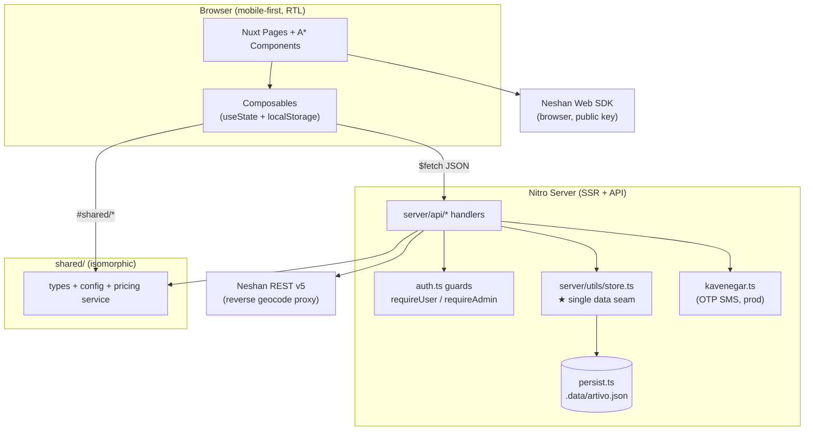
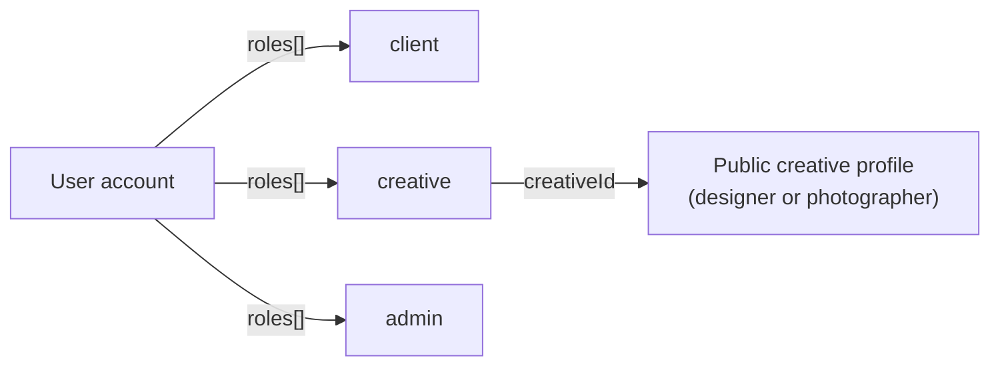
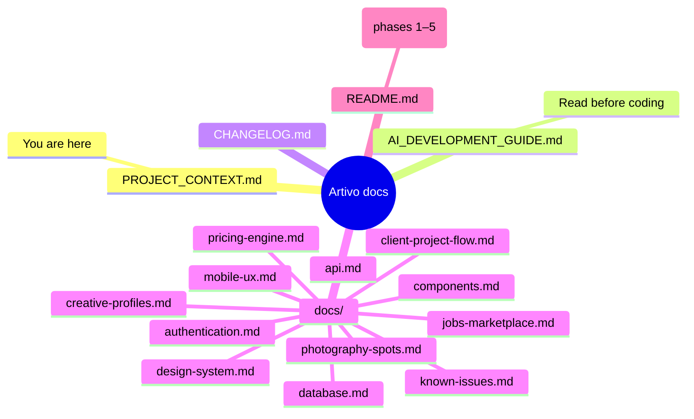

# PROJECT_CONTEXT.md — Artivo (آرتیوو)

> **Primary source of truth** for the Artivo codebase.
> Every statement here reflects what is **actually implemented** in the repository — nothing speculative.
> Companion docs live in [`/docs`](./docs). AI agents must also read [`AI_DEVELOPMENT_GUIDE.md`](./AI_DEVELOPMENT_GUIDE.md) before changing code.
>
> **Last Updated:** 2026-08-27 · HEAD: `5f3c5f0` · branch: `arena/01a042e5-artivo`

---

## 1. Project Overview

| Field | Value |
|---|---|
| **Project name** | Artivo — آرتیوو |
| **Product** | Mobile-first **creative marketplace** connecting clients with graphic designers and photographers |
| **Language / direction** | Persian (Farsi) UI, **RTL-first** (`<html lang="fa" dir="rtl">`), light mode only |
| **Version** | 0.1.0 (pre-1.0, active development) |
| **Status** | 6 development phases **implemented** + 1 polish pass (see [CHANGELOG.md](./CHANGELOG.md)) |

**Problem it solves:** clients (cafés, brands, event organizers) need graphic design and photography work; designers/photographers need clients. Artivo gives clients a guided brief wizard with **transparent instant price estimates**, and gives creatives portfolio pages, a jobs marketplace, and an end-to-end project workspace with chat and file delivery.

**Core concept:** a client briefs a project once (8-step wizard) → gets an automatic estimate → can either submit a direct request (current flow stores it client-side — see Known Issues) or publish it as a **Project** that creatives propose on → client accepts a proposal → both sides chat, share files, iterate through revisions → client approves and the project completes.

**Target users / roles:**

| Role | Exists in code? | Notes |
|---|---|---|
| **Client** (کارفرما) | ✅ Implemented | `UserRole = 'client'` — briefs projects, publishes projects, accepts proposals, requests revisions, approves work |
| **Creative** (خلاق) | ✅ Implemented | `UserRole = 'creative'` — one user can hold **both** client + creative roles |
| — Graphic designer | ✅ Implemented | `CreativeKind = 'designer'` (profile taxonomy, not an auth role) |
| — Photographer | ✅ Implemented | `CreativeKind = 'photographer'` |
| **Admin** (مدیر) | ✅ Implemented | `UserRole = 'admin'` — pricing rules, content collections, user list |

A user is **one account with a roles array**; a `creative` user also gets a public `creativeId` linking to a public profile.

**Major product areas (all verifiable in the repo):**

| Area | Status | Where |
|---|---|---|
| Client project request wizard (`/create`) | ✅ Implemented (estimate is real; **submission stored in localStorage only**) | [`/docs/client-project-flow.md`](./docs/client-project-flow.md) |
| Pricing engine (centralized, admin-editable) | ✅ Implemented | [`/docs/pricing-engine.md`](./docs/pricing-engine.md) |
| Creative profiles + portfolio + services | ✅ Implemented (static seed data + admin overlay + community profiles via API) | [`/docs/creative-profiles.md`](./docs/creative-profiles.md) |
| Jobs marketplace (browse, brief, propose) | ✅ Implemented (job data is static mock + admin overrides; **proposals are localStorage**) | [`/docs/jobs-marketplace.md`](./docs/jobs-marketplace.md) |
| Photography spots + **Neshan map** | ✅ Implemented (map works with or without API key) | [`/docs/photography-spots.md`](./docs/photography-spots.md) |
| Authentication (password + OTP/Kavenegar) | ✅ Implemented | [`/docs/authentication.md`](./docs/authentication.md) |
| Admin panel (stats, pricing, collections, users) | ✅ Implemented | [`/docs/api.md`](./docs/api.md) § admin |
| Projects (lifecycle, proposals, delivery, revisions) | ✅ Implemented (server-persisted) | § 9 below + [`/docs/api.md`](./docs/api.md) |
| Internal chat (project-linked threads) | ✅ Implemented — **polling (4 s), not WebSocket**; real-time-ready seam isolated in `useConversations` | [`/docs/api.md`](./docs/api.md) § conversations |
| Notifications | ✅ Implemented (server-persisted, 25 s polling) | [`/docs/api.md`](./docs/api.md) |
| Saved items (jobs / creatives / spots) | ✅ Implemented — **localStorage per browser** | § 10 (State) |
| **Payments** | ❌ **Not implemented — explicitly out of scope** | — |
| Real database / ORM | ❌ Not implemented — JSON file store (`.data/artivo.json`) | [`/docs/database.md`](./docs/database.md) |
| Image/file uploads to server | ❌ Not implemented — attachments inline as `data:` URLs (≤ 500 KB each) | [`/docs/known-issues.md`](./docs/known-issues.md) |

---

## 2. Technology Stack

Read directly from `package.json`, `nuxt.config.ts` and the lockfile — **no guessed versions**.

| Concern | Technology | Evidence |
|---|---|---|
| Framework | **Nuxt 4.5.2** (Nitro 2.x, Vite) | `package.json` → `"nuxt": "4.5.2"` |
| UI framework | **Vue ^3.5.18** (Composition API, `<script setup>`) | `package.json` |
| Language | **TypeScript ^5.9.2, strict mode** (`typescript.strict: true`) | `package.json`, `nuxt.config.ts` |
| Type checking | `vue-tsc ^3.0.5` via `nuxt typecheck` (`typeCheck: false` in dev builds — run explicitly) | `package.json`, `nuxt.config.ts` |
| Styling | **Hand-rolled CSS design system** — tokens in `app/assets/css/main.css` + scoped SFC styles. **No Tailwind, no CSS-in-JS, no UI kit** | `app/assets/css/main.css` |
| Fonts | Google Fonts CDN: **Vazirmatn** (base Persian), Fraunces (Latin/editorial) + 8 preview families for the wizard font-picker | `nuxt.config.ts` head links |
| State management | **No Pinia/Vuex** — Nuxt `useState` singletons inside composables + `localStorage` persistence (keys prefixed `artivo:`) | `app/composables/*` |
| Database | **None.** Dev JSON file store at `.data/artivo.json` via `server/utils/persist.ts` (gitignored). Swappable seam documented in the store header | `server/utils/store.ts` |
| ORM | None | — |
| Authentication | **Cookie sessions** (`artivo_session`, httpOnly, SameSite=Lax, 30-day TTL) + **scrypt** password hashing (`node:crypto`) + OTP SMS | `server/utils/auth.ts`, `server/utils/crypto.ts` |
| SMS / OTP provider | **Kavenegar** (verify/lookup endpoint) — production only; dev uses fixed code `1111` | `server/utils/kavenegar.ts` |
| Map | **Neshan Web SDK v1.1.0** (public key) behind a swappable `MapController` abstraction; **Neshan REST v5 reverse geocoding** proxied server-side (secret key) | `app/composables/useMapProvider.ts`, `server/api/neshan/reverse.get.ts` |
| File/image storage | Static assets in `public/images/**` (committed). User attachments/spot photos are **base64 `data:` URLs** (localStorage or JSON store) | `public/`, `server/utils/validate.ts` |
| API architecture | Nitro **server routes** (`server/api/**`), JSON over HTTP, cookie-based auth guards | `server/api/**` |
| Validation | Custom helpers (`server/utils/validate.ts`), no zod/yup | `server/utils/validate.ts` |
| Testing | **None** (no unit/E2E framework installed) — QA is manual + `nuxt typecheck` + `nuxt build` | `package.json` |
| Package manager | **npm** (lockfile committed; `.npmrc`: `audit=false fund=false`) | `package-lock.json`, `.npmrc` |
| Linter/formatter | **None configured** | — |

Install command: `npm install --legacy-peer-deps --no-audit --no-fund`

---

## 3. Project Architecture

```
artivo/
├── app/                        # Nuxt 4 app directory (client + SSR)
│   ├── assets/css/main.css     # ★ design tokens + base styles (single source of visual truth)
│   ├── components/
│   │   ├── ui/                 # 21 design-system primitives (AButton, AInput, AModal, ...)
│   │   ├── home/ cards/ creatives/ jobs/ spots/ project/ create/ site/ admin/ auth/
│   ├── composables/            # 18 composables = ALL state & logic layer (see § 10)
│   ├── layouts/                # default (header/footer/bottom-nav) + admin
│   ├── middleware/             # auth.ts · guest.ts · admin.ts (route guards)
│   ├── pages/                  # file-based routing (see § 4)
│   ├── plugins/                # auth.global.ts (SSR session hydration), reveal.ts (scroll animations)
│   └── error.vue, app.vue
├── server/
│   ├── api/                    # Nitro endpoints (see /docs/api.md)
│   │   ├── auth/ · admin/ · projects/ · conversations/ · notifications/
│   │   ├── pricing/ · profile/ · public/ · neshan/
│   └── utils/                  # store.ts (★ data layer seam) · auth.ts · crypto.ts ·
│                               # kavenegar.ts · persist.ts · validate.ts · constants.ts
├── shared/                     # isomorphic code imported via #shared/* from BOTH app & server
│   ├── types/index.ts          # all shared TS types/interfaces
│   ├── config/                 # pricing.ts · catalog.ts · admin-collections.ts · project-status.ts ·
│   │                           # project-types.ts · palettes.ts · font-pairings.ts · *-categories.ts
│   ├── services/pricing.ts     # ★ the ONLY price calculation code
│   ├── data/                   # static mock/seed content (creatives, jobs, spots, services, ...)
│   └── utils/                  # format.ts (تومان/digits) · geo.ts (haversine)
├── public/images/              # committed seed imagery (~2.8 MB, compressed)
├── docs/                       # ★ this documentation system
├── .data/                      # runtime JSON store (gitignored, dev only)
├── nuxt.config.ts              # runtimeConfig = all env vars (secrets never hardcoded)
└── PROJECT_CONTEXT.md · AI_DEVELOPMENT_GUIDE.md · CHANGELOG.md · README.md (Persian)
```

`#shared/*` is the isomorphic alias — shared code is imported identically from `app/` and `server/`.



**Key architectural rule:** *all* business data flows through the composable layer on the client and the `store.ts` seam on the server. Replacing the JSON store with a real database touches **one file**; replacing polling chat with WebSockets touches **one composable**.

---

## 4. Application Routes

Middleware column: `auth` = must be logged in, `guest` = logged-out only, `admin` = admin role + admin layout, `—` = public.

| Route | Purpose | User type | Middleware | Status |
|---|---|---|---|---|
| `/` | Editorial landing page (hero, categories, creatives, spots teaser, CTA) | All | — | ✅ Implemented |
| `/services` | Services marketplace index | All | — | ✅ Implemented |
| `/services/[id]` | Service detail (what's included, portfolio, creatives, CTA into wizard) | All | — | ✅ Implemented |
| `/creatives` | Creative directory (filter by kind/category/city/search) | All | — | ✅ Implemented |
| `/creatives/[id]` | Public creative profile (hero, stats, portfolio preview, services, reviews) | All | — | ✅ Implemented |
| `/creatives/[id]/portfolio` | Full portfolio gallery with lightbox | All | — | ✅ Implemented |
| `/jobs` | Jobs marketplace (search, filter chips, bottom-sheet filters, paging) | All | — | ✅ Implemented |
| `/jobs/[id]` | Job brief detail + proposal modal (localStorage) | All (apply → localStorage) | — | ✅ Implemented |
| `/spots` | Photography spots map + list explorer | All | — | ✅ Implemented |
| `/spots/[id]` | Spot detail (photos, rating, best time, mini-map) | All | — | ✅ Implemented |
| `/spots/new` | Add a spot (map click + photos as data-URLs → localStorage) | All | — | ✅ Implemented |
| `/saved` | Saved hub (jobs / creatives / spots — localStorage) | All (data is per-browser) | — | ✅ Implemented |
| `/create` | 8-step client project wizard (full-screen, immersive layout) | All | — | ✅ Implemented |
| `/auth/login` | Login (email/mobile + password, OTP tab) | Guest | `guest` | ✅ Implemented |
| `/auth/register` | Register (name, mobile, email, password, role picker) | Guest | `guest` | ✅ Implemented |
| `/auth/verify` | OTP verification (dev code `1111`) | Guest | `guest` | ✅ Implemented |
| `/auth/forgot` | Password recovery request | Guest | `guest` | ✅ Implemented |
| `/auth/reset` | Password reset with token | Guest | `guest` | ✅ Implemented |
| `/dashboard` | Role-switched dashboard (client ↔ creative views) | Client/Creative | `auth` | ✅ Implemented |
| `/projects` | My projects (tabs: as client / as creative) | Auth | `auth` | ✅ Implemented |
| `/projects/new` | Quick project create form (title/type/desc/budget/deadline) | Client | `auth` | ✅ Implemented |
| `/projects/[id]` | Project workspace (status timeline, proposals, delivery, revision drawers, sticky CTA) | Participant | `auth` | ✅ Implemented |
| `/messages` | Conversation list + unread badges | Auth | `auth` | ✅ Implemented |
| `/messages/[id]` | Full-screen chat (immersive layout, optimistic send, read receipts, typing dots) | Participant | `auth` | ✅ Implemented |
| `/notifications` | Notification feed (mark one/all read) | Auth | `auth` | ✅ Implemented |
| `/profile` | Account hub (manage links, my requests, my proposals) | Auth | `auth` | ✅ Implemented |
| `/profile/client` | Client brand profile editor | Auth | `auth` | ✅ Implemented |
| `/profile/creative` | Public creative profile create/link/edit | Auth | `auth` | ✅ Implemented |
| `/profile/settings` | Account info, password change, roles | Auth | `auth` | ✅ Implemented |
| `/admin` | Admin overview (stats cards) | Admin | `admin` | ✅ Implemented |
| `/admin/pricing` | Live pricing rules editor (base prices, min, multipliers) + reset | Admin | `admin` | ✅ Implemented |
| `/admin/collection/[name]` | Generic collection manager (`font-packs`, `color-palettes`, `project-categories`, `creative-categories`, `photography-categories`, `services`, `users`) | Admin | `admin` | ✅ Implemented |
| `/*` (unknown) | Branded 404/error page | All | — | ✅ `app/error.vue` |

Server route protection is **independent** of page middleware: every API handler calls `requireUser()` / `requireAdmin()` / explicit participation checks (see [`/docs/api.md`](./docs/api.md)).

---

## 5. User Roles & Permissions

Roles live in `StoredUser.roles: ('client' | 'creative' | 'admin')[]` — **a user can combine client + creative**. Registration lets users pick roles; the creative role additionally links a public profile via `creativeId`.



**Access rules actually enforced in code:**

| Action | Who | Enforced at |
|---|---|---|
| View own projects / create project / publish / open / accept / cancel / approve / request revision | Owner client (or admin) | `server/api/projects/**` guards |
| View open market (`/api/projects/open`) | Any logged-in user; own projects excluded | `open.get.ts` |
| Submit proposal / deliver work | Any creative, once per project; selected creative for delivery | `proposal.post.ts`, `deliverable.post.ts` |
| View project detail | Client, selected creative, any user with a pending proposal, admin | `[id]/index.get.ts` |
| Chat in a thread | Thread members (or admin) | `conversations/[id]/**` |
| Read notifications | Owner only | `notifications/index.get.ts` |
| Admin panel & admin APIs | `roles.includes('admin')` | `requireAdmin()` + `admin.ts` middleware |
| Public creative profile create/edit | Any logged-in user (`POST/PUT /api/profile/creative`) | `server/api/profile/creative.*` |

---

## 6–7. Design System & Mobile Rules

Documented in depth in their own files (extracted from the real tokens in `app/assets/css/main.css`):

- **[`/docs/design-system.md`](./docs/design-system.md)** — light-only editorial system, exact color palette, typography (Vazirmatn/Fraunces via swappable tokens), spacing, radii, shadows, all 21 `A*` primitives.
- **[`/docs/mobile-ux.md`](./docs/mobile-ux.md)** — mobile-first rules: breakpoints, bottom navigation, bottom sheets, touch targets, keyboard handling, sticky CTAs, no-horizontal-overflow guarantees.

---

## 8. Client Project Creation Flow

Full step-by-step documentation: **[`/docs/client-project-flow.md`](./docs/client-project-flow.md)**.
Summary: 8 full-screen steps (Type → Size → Visual → Font → Brief → Budget → Contact → Review) driven by `useProjectRequest` (`useState` + localStorage draft `artivo:draft:v1`). Validation is per-step, on «ادامه» click only; back-navigation never loses data; review step edits any section individually.

> ⚠️ **Accuracy note:** the wizard computes a **real** price estimate via the pricing engine, but final submission (`ART-####` request) is generated **client-side and stored in localStorage only** (`artivo:requests:v1`). It is *not* sent to the server. Publishing a real, server-backed project is done via `/projects/new` or accepted proposals (Phase 6 API).

---

## 9. Pricing Engine (summary)

Centralized in `shared/services/pricing.ts` (the **only** calculation code) fed by `shared/config/pricing.ts` defaults, overridable live by admin rules (stored in the JSON store, served via `/api/pricing/config`):

```
total = roundTo10k( max( minimumPrice, base×sizeFactor×complexityFactor×urgencyFactor + Σ addOns ) )
```

Details, admin overrides, and a worked example: **[`/docs/pricing-engine.md`](./docs/pricing-engine.md)**.

---

## 10. State Management

There is **no state library**. Everything is one of four patterns:

| Pattern | Where | Examples |
|---|---|---|
| **Server session state** | `artivo_session` httpOnly cookie → `GET /api/auth/me` → `useState('artivo-user')`, hydrated during SSR by `plugins/auth.global.ts` | `useAuth` |
| **Server-persisted app state** | `useState` cache + `$fetch` + polling against server APIs (data lives in `.data/artivo.json`) | `useProjects`, `useConversations`/`useThread` (4 s polling, tab-visibility aware), `useNotifications` (25 s + focus), `useOverlay` (`useFetch`, shared SSR key `artivo-overlay`) |
| **Client-only persisted state** | `useState` + deep-`watch` → `localStorage` (keys below) | wizard draft, saved items, job proposals, user spots |
| **Form state** | Local `reactive()`/`ref` per page + explicit validation errors; wizard state is the exception (global composable) | `projects/new.vue`, auth pages |

**localStorage keys (all versioned, prefix `artivo:`):**

| Key | Composable | Content |
|---|---|---|
| `artivo:draft:v1` | `useProjectRequest` | Wizard draft (resumable) |
| `artivo:requests:v1` | `useMyRequests` | Submitted wizard requests (**client-side only**) |
| `artivo:saved-jobs:v1` | `useSavedJobs` | Saved job ids |
| `artivo:saved-creatives:v1` | `useSavedCreatives` | Saved creative ids |
| `artivo:saved-spots:v1` | `useSavedSpots` | Saved spot ids |
| `artivo:proposals:v1` | `useJobProposals` | Job proposals (**client-side only**) |
| `artivo:user-spots:v1` | `useSpots` | User-added photo spots |
| `artivo:spot-photos:v1` | `useSpots` | User photos added to spots |
| `artivo:spot-ratings:v1` | `useSpots` | User's spot ratings |

`useToast` (toasts), `useMapProvider` (map SDK), `useUserLocation` (geolocation) are stateless/singletons. Chat typing state uses a server TTL window (4 s) — no client persistence.

---

## 11. Data at a Glance

There is **no database** — the full model documentation (JSON store shapes, mock data modules, and a clearly-labeled *Recommended Future Data Model*) is in **[`/docs/database.md`](./docs/database.md)**.

---

## 12. Documentation Map



---

## Last Updated

Generated **2026-08-27** during the documentation task against commit `5f3c5f0` (post Phase-6 + polish pass). This file documents only what exists in the repository at that commit.
