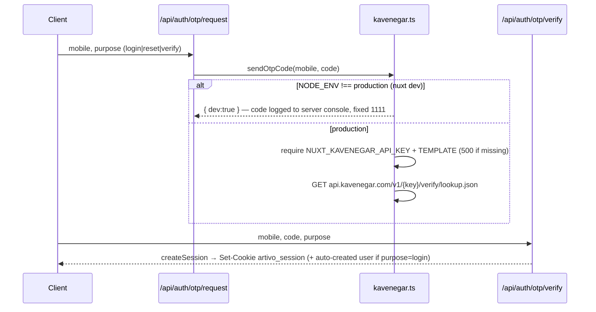

# Authentication — Artivo

> Code: `server/api/auth/**` · `server/utils/{auth,crypto,kavenegar,constants}.ts` · `app/composables/useAuth.ts` · `app/plugins/auth.global.ts` · `app/middleware/{auth,guest,admin}.ts` · `app/pages/auth/**`
> Related: [`api.md`](./api.md) · [`PROJECT_CONTEXT.md`](../PROJECT_CONTEXT.md)

**Last Updated:** 2026-08-27 · Status: **Implemented**

---

## 1. Capabilities (all real, server-persisted)

| Capability | How |
|---|---|
| Register | name + Iranian mobile + email (optional) + password + role picker (`client`/`creative`) → account created **unverified**, OTP verify required |
| Login | **identifier** (email *or* mobile) + password |
| Mobile OTP login | `purpose:'login'` — auto-creates a mobile-first account (no password, `hasPassword:false`) |
| Verify mobile | `purpose:'verify'` for the current session's user |
| Password reset | forgot → OTP (`purpose:'reset'`) → one-time reset token (10 min) → new password |
| Password change | authenticated, requires current password |
| Profile edit | name/email/brand profile/roles via `PUT /api/auth/profile` |
| Logout | destroys server session + cookie |

## 2. Sessions & Tokens

- **Opaque session tokens** (`randomBytes(24)` hex) in a server-side `sessions` map; client holds cookie **`artivo_session`**: `httpOnly`, `SameSite=Lax`, `Secure` in production, **30-day TTL**.
- **Password hashing:** scrypt (`node:crypto`), format `scrypt:<salt-hex>:<hash-hex>`, `timingSafeEqual` comparison. No external dependency.
- `GET /api/auth/me` resolves the session → `PublicUser` (hashes never leave the server — `toPublicUser()` whitelists fields).
- The SSR plugin (`plugins/auth.global.ts`) resolves the session **before first paint** (`useRequestFetch`) so guards and the header never flash.

## 3. OTP (Kavenegar)

**Constants** (`server/utils/constants.ts`): code TTL **2 min** · resend gap **45 s** · max **5 attempts** per code · reset token TTL **10 min**.



### ⚠️ Development OTP behavior — read carefully

- **With `nuxt dev` (`NODE_ENV !== 'production'`) every OTP code is `1111`** and **no SMS is sent**; the code is printed to the server console. `NUXT_PUBLIC_AUTH_DEV_MODE` also lets the login/verify UI show a dev hint.
- This is **development-only by construction**: `sendOtpCode()` checks `process.env.NODE_ENV !== 'production'` **before anything else**, and production **hard-fails (HTTP 500)** if Kavenegar env vars are missing rather than falling back to `1111`. **Never** rely on `1111` outside local dev; never weaken this guard.

## 4. Route Protection

| Layer | Mechanism |
|---|---|
| Pages | `definePageMeta({ middleware })` → `auth.ts` (redirect `/auth/login?redirect=…`), `guest.ts` (→ `/profile`), `admin.ts` (non-admin → `/`) |
| APIs | Every handler calls `requireUser()` (401) / `requireAdmin()` (403) / explicit participation checks — page guards are **not** the security boundary |
| Client state | `useAuth().user` (`useState('artivo-user')`), hydrated during SSR |

## 5. Environment Variables (no real secrets here)

```env
# Production SMS OTP (server-side only) — required in production
NUXT_KAVENEGAR_API_KEY=your_kavenegar_api_key_here
NUXT_KAVENEGAR_OTP_TEMPLATE=your_approved_template_name
# Optional sender line
NUXT_KAVENEGAR_SENDER=
```

`authDevMode` is derived automatically (`NODE_ENV !== 'production'` in `nuxt.config.ts`) — there is nothing to set.

## 6. Demo Accounts (dev seeds, password `artivo1234`)

| Identifier | Name | Roles |
|---|---|---|
| `admin@artivo.ir` / `09120000000` | مدیر آرتیوو | admin |
| `client@artivo.ir` / `09120000001` | سارا محمدی | client |
| `leila@artivo.ir` / `09120000002` | لیلا فرهمند | creative (+client) → public profile `leila-farhmand` |

Seeded by `server/utils/store.ts` on first boot into `.data/artivo.json` (dev store — delete `.data/` to reseed).
