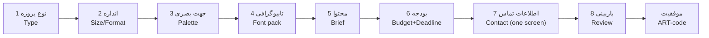

# Client Project Creation Flow — `/create`

> The 8-step wizard that turns a client's idea into a priced brief.
> State: `app/composables/useProjectRequest.ts` · UI: `app/pages/create.vue` + `app/components/create/Step*.vue`
> Related: [`pricing-engine.md`](./pricing-engine.md) · [`PROJECT_CONTEXT.md`](../PROJECT_CONTEXT.md)

**Last Updated:** 2026-08-27 · Status: **Implemented** (submission is client-side only — see ⚠️ at the end)

---

## 1. Flow Overview

- Full-screen **immersive** route (header/bottom-nav hidden), own sticky top bar (exit · Artivo wordmark · «خلاصه» drawer) and progress track.
- Desktop gets a sticky summary rail (`CreateSummary`); mobile opens it as a bottom-sheet drawer (`ADrawer`) — the estimate is always visible in the footer.
- Entry deep-links: `/create?type=poster&creative=leila-farhmand` pre-select type/creative (handled in `onMounted`).

## 2. Steps & Actual Data Collected

| # | Step key | Component | Data collected (shape in `ProjectRequestState`) | Valid when |
|---|---|---|---|---|
| 1 | `type` | `StepType` | `state.type: ProjectTypeId` (10 types: poster, social, menu, ad, logo, branding, packaging, ui, photoEdit, other) | type ≠ null |
| 2 | `size` | `StepSize` | `state.size: { presetId, medium, custom: {width,height,unit} }` — preset grid **or** custom dimensions (cm/px); changing type resets size (presets differ per type) | preset chosen **or** custom w+h > 0 |
| 3 | `visual` | `StepVisual` | `state.visual: { paletteId, customPrimary, customSecondary, isCustom }` — curated palettes (`shared/config/palettes.ts`) or custom color pair with live preview | palette **or** `isCustom` |
| 4 | `font` | `StepFont` | `state.fontPairingId` — font packs from `shared/config/font-pairings.ts` (Persian×Latin pairings with live preview); admin can add/edit packs | pairing chosen |
| 5 | `brief` | `StepBrief` | `state.brief: { mainText (≥2), description (≥20), requirements, files: BriefFile[], links }` — main text, project description, requirements, reference links/files | mainText ≥2 **and** description ≥20 chars |
| 6 | `budget` | `StepBudget` | `state.budget: { min, max, deadlineId, urgencyId, complexityId, addOnIds[] }` — optional budget range (compared to estimate), deadline preset, urgency & complexity multipliers, add-on checkboxes | deadline chosen |
| 7 | `client` | `StepClient` | `state.client: { fullName (≥3), mobile (valid), email (optional, validated), telegram }` — **all contact info in one section** | name + valid Iranian mobile (+ optional email format) |
| 8 | `review` | `StepReview` | `state.confirmed: boolean` — sectioned summary with **per-section ویرایش buttons** (jump back without data loss), `EstimatePanel`, confirmation checkbox | checkbox checked |

## 3. State Management & Persistence

- Single `useState('artivo-request')` global state + `useState('artivo-request-step')`.
- **Draft persistence:** every deep-watch change writes the whole state to `localStorage['artivo:draft:v1']` (after mount, to protect hydration). Leaving and returning resumes exactly where the user left off; the exit modal («از ویزارد خارج می‌شوی؟») is therefore truthful.
- **Back-navigation:** `back()` only decrements the step — nothing is cleared. The only destructive reset is explicit (`startNew`/`reset`, also clears the draft key).
- Changing project type (step 1) intentionally resets only the **size** section (presets are type-specific); everything else survives.

## 4. Validation & Navigation Behavior

- `validity: computed<boolean[]>` evaluates all 8 steps; `canGoNext` gates only the current step.
- Blocked «ادامه» shows a **step-specific Persian toast** (e.g. «متن اصلی و توضیح پروژه (حداقل ۲۰ کاراکتر) را بنویس.») — never a silent no-op, never inline errors before the attempt.
- Field-level soft errors (name too short, mobile format) appear as inline hints on step 7 without blocking typing.
- Live estimate (footer + summary + review) recalculates reactively via `usePricing().estimate`.

## 5. Review Screen (step 8)

- Sections numbered with Latin editorial numerals; empty fields shown explicitly («انتخاب نشده» / «نوشته نشده») rather than hidden.
- «ویرایش» jumps to the exact source step (`step.value = n`) and preserves everything; returning to review keeps later answers.
- `ACheck` confirmation required before «ثبت درخواست» activates the submit path.

## 6. Submission & Success

> ⚠️ **Current behavior (be accurate about this):** `submit()` in `create.vue` is a **900 ms simulated delay**, generates `ART-####` **in the browser**, saves to `localStorage['artivo:requests:v1']` via `useMyRequests`, shows `StepSuccess` (copyable code + CTA to the Phase-6 dashboard for logged-in users) and a toast. **No server call is made.** Connecting this to the backend is the designated next integration point (see [`known-issues.md`](./known-issues.md#1-wizard-submission-is-client-side-only)).

## 7. Pricing During the Flow

The estimate uses the same central engine as everywhere else — `calculateEstimate(state)` from `shared/services/pricing.ts` — with admin-overrideable config fetched from `/api/pricing/config`. Formula and worked example: [`pricing-engine.md`](./pricing-engine.md).
