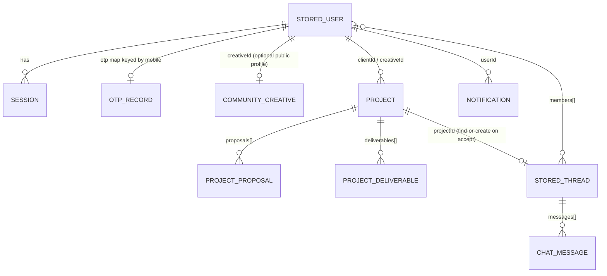

# Database & Data Models — Artivo

> **Reality check:** Artivo has **no database and no ORM**. All server-persisted data lives in a single JSON file (`.data/artivo.json`, gitignored) managed by `server/utils/store.ts` + `persist.ts`. Static/mock content lives in `shared/data/*.ts` (committed). Client-only content lives in `localStorage`.
> Related: [`api.md`](./api.md) · [`known-issues.md`](./known-issues.md) · [`PROJECT_CONTEXT.md`](../PROJECT_CONTEXT.md)

**Last Updated:** 2026-08-27

---

## 1. Current Persistence Map

| Layer | Location | Contents |
|---|---|---|
| **JSON store** (server) | `.data/artivo.json` ←→ `server/utils/store.ts` (`StoreData`) | users, sessions, OTPs, reset tokens, admin pricing rules, admin collections, overlay overrides, community creatives, **projects, threads, notifications** |
| **Static seeds** (committed) | `shared/data/{content,jobs,portfolio,reviews,services,spots}.ts` | creatives, portfolios, reviews, services, jobs, photo spots (+ taxonomies in `shared/config/*`) |
| **Client localStorage** | keys prefixed `artivo:` (see [`PROJECT_CONTEXT.md` § 10](../PROJECT_CONTEXT.md#10-state-management)) | wizard draft/requests, saved items, job proposals, user spots/photos/ratings |

The store is loaded once per server boot (`globalThis` singleton), mutated in memory, and saved synchronously to disk on every write. **Design intent (stated in the code header):** swapping in a real database means rewriting **`server/utils/store.ts` only** — API contracts stay fixed.

## 2. Actual Server-Side Models (`StoreData`)

| Model | Key fields (actual) | Notes |
|---|---|---|
| `StoredUser` | id, name, email, mobile, passwordHash (`scrypt:…` or null), `roles[]`, mobileVerified, active, `clientProfile{}`, creativeId, createdAt | Seeded demo accounts included |
| `OtpRecord` | code, purpose (`login|reset|verify`), exp, attempts, lastSent | Keyed by mobile; TTL/attempt limits in `constants.ts` |
| sessions / resets | token → `{ userId, exp }` | Opaque random tokens |
| `Project` | id `prj-*`, code `PRJ-####`, title, typeId/Label, description, budgetMin/Max, deadlineDays, **status** (8-state machine), clientId/Name, creativeId/Name, `proposals[]`, `deliverables[]`, revisionCount, timestamps | Full lifecycle documented in [`api.md`](./api.md#projects) |
| `ProjectProposal` | id, creativeId/Name, price, deliveryDays, message, status `pending|accepted|rejected`, createdAt | Accept auto-rejects other pendings |
| `ProjectDeliverable` | id, authorId/Name, note, `files: FileAttachment[]`, revisionNo, createdAt | revisionNo > 1 = re-delivery after a revision request |
| `StoredThread` | id `th-*`, projectId?, `members[]`, `messages[]`, `typing: Record<userId, ts>` | Typing = 4 s server TTL window |
| `ChatMessage` | id, from, fromName, body (≤2000), `files[]` (data-URL ≤500 KB ×4), at, readAt | Read receipts set on fetch |
| `NotificationItem` | id, userId, kind, title, body, link, readAt, createdAt | Max 60 kept per feed |
| `adminPricing` | `AdminPricingRules` (base prices, min, multipliers, size overrides) | Served via `/api/pricing/config` |
| `collections` / `overrides` / `deleted` | admin collection rows + patch/delete maps over static seeds | Registry: `shared/config/admin-collections.ts` |

## 3. Mock Data Modules (NOT server data)

`shared/data/**` are **committed static arrays** treated as read-only content with admin patching:

- `content.ts` — featured creatives, home categories/stats
- `jobs.ts` — 6 demo job briefs (662 lines, with clients & reference images)
- `portfolio.ts` / `reviews.ts` — portfolio items & testimonials
- `services.ts` — creative services catalog
- `spots.ts` — photography spots

## 4. Recommended Future Data Model

> ⚠️ **The following is a RECOMMENDATION, not current implementation.** Listed so a backend phase can map existing shapes 1:1; every field above already mirrors these concepts.

| Table/Collection | Maps from today | Notes |
|---|---|---|
| `users` | `StoredUser` | + email verification, refresh tokens |
| `sessions` | sessions map | Or JWT; keep opaque-token option |
| `creative_profiles` | community creatives + seeds | FK → users; kind enum |
| `portfolio_items` / `portfolio_images` | `PortfolioItem` / static seeds | image FKs → object storage |
| `services` | `CreativeService` seeds + createdServices | m2m creatives |
| `jobs` | `Job` seeds + overrides | becomes first-class, `proposals` FK |
| `job_proposals` | localStorage `JobProposal` | **currently client-only — must be created** |
| `projects` / `project_proposals` / `project_deliverables` | `Project` / `ProjectProposal` / `ProjectDeliverable` | direct port |
| `threads` / `messages` | `StoredThread` / `ChatMessage` | + WebSocket presence |
| `notifications` | `NotificationItem` | + push channel |
| `reviews` | static reviews | profile/job reviews |
| `photo_spots` / `spot_photos` / `spot_ratings` | seeds + localStorage | user content goes server-side |
| `files` | inline data-URL `FileAttachment` | object storage + signed URLs |
| `pricing_rules` | `adminPricing` | versioned config |

**Migration contract:** keep every `/api/**` request/response shape identical (handlers + `#shared/types`), replace only `store.ts` internals; replace client `localStorage` composables' storage backend signature-compatibly (as their headers already promise).
