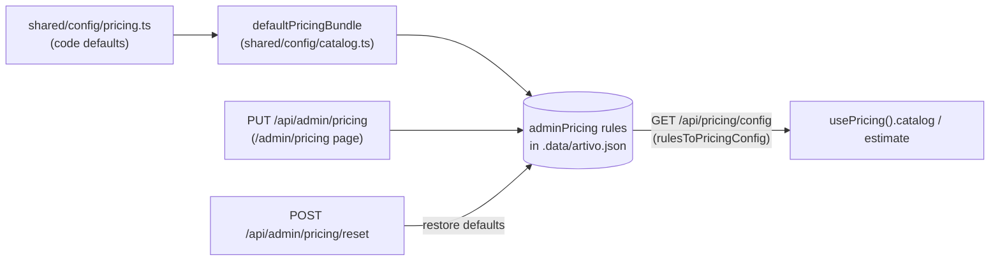

# Pricing Engine — Artivo

> The **single source of price calculation**: `shared/services/pricing.ts`, fed by `shared/config/pricing.ts` (defaults) and live admin rules (JSON store → `/api/pricing/config`).
> Related: [`client-project-flow.md`](./client-project-flow.md) · [`api.md`](./api.md) · [`PROJECT_CONTEXT.md`](../PROJECT_CONTEXT.md)

**Last Updated:** 2026-08-27 · Status: **Implemented** (all amounts in **تومان**; prices are estimates, not charges — payments are out of scope)

---

## 1. The Formula (actual code)

```ts
subtotal = base
         × sizeFactor          // preset multiplier OR custom-area tier
         × complexityFactor    // 0.85 | 1 | 1.35
         × urgencyFactor       // 1 | 1.25 | 1.6
subtotal += Σ addOns           // fixed flat prices
subtotal  = max(subtotal, minimumPrice)          // floor, reported as a visible «minimum» line
total     = max(10_000, round(subtotal / 10_000) × 10_000)  // PM() rounding to 10k تومان
```

Every applied factor/charge becomes an `EstimateLine` (`kind: 'base' | 'multiplier' | 'addon' | 'minimum'`) so the UI can show a transparent breakdown (`EstimatePanel`).

**Custom-size multiplier** — area tiers in cm² (px converted at 37.8 px/cm):

| Area (cm²) | ≤ 625 | ≤ 2500 | ≤ 6500 | ≤ 15000 | > 15000 |
|---|---|---|---|---|---|
| Multiplier | 1 | 1.3 | 1.7 | 2.2 | 2.8 |

## 2. Default Config (`shared/config/pricing.ts`)

| Input | Values |
|---|---|
| `minimumPrice` | 500,000 |
| **Base prices** | poster 1.8M · social 900k · menu 1.4M · ad 1.2M · **logo 3.5M** · **branding 8M** · packaging 4.5M · **ui 12M** · photoEdit 600k · other 1.5M |
| Complexity | ساده ×0.85 · استاندارد ×1 · پیچیده ×1.35 (default `standard`) |
| Urgency | عادی ×1 (10–14 days) · سریع ×1.25 (3–7 days) · فوری ×1.6 (≤48h) (default `normal`) |
| Add-ons (flat) | source-file 400k · copywriting 350k · icon-set 600k · social-pack 500k · extra-revisions 500k · print-ready 250k |
| Size presets | per-type `sizeConfigs` in `shared/config/project-types.ts` (A4/A3/A5/…), each with its own multiplier; admin can override per-preset |
| `includedRevisions` | 2 (display only — the Phase-6 project flow does **not** enforce a revision cap) |
| `customMaxRatio` | 5 (aspect sanity for custom sizes) |

## 3. Where the Rules Live & How to Change Them



- **To change prices in a running instance:** Admin panel → `/admin/pricing` (edits base prices, minimum, complexity/urgency multipliers, size-preset multipliers) or `PUT /api/admin/pricing`. Reset restores code defaults.
- **To change prices in code:** edit `shared/config/pricing.ts` (+ `sizeConfigs`). Never hardcode amounts in components — components only render `EstimateLine`s.
- `usePricing()` exposes `catalog` (live config) and `estimate` (reactive `calculateEstimate(wizardState)`).

## 4. Worked Example

Poster, A3 preset (×1.3), پیچیده complexity (×1.35), فوری urgency (×1.6), add-ons source-file + print-ready:

```
base        = 1,800,000
1.8M × 1.3 × 1.35 × 1.6  = 5,080,800  (hmm: 1.8×1.3=2.34 → ×1.35=3.159 → ×1.6=5,054,400)
+ 400,000 + 250,000      = 5,704,400
≥ minimum 500,000 ✓
total      = round10k → 5,700,000 تومان
```

Lines rendered: قیمت پایه · اندازه و فرمت (A3 · ضریب) · سطح پیچیدگی · تحویل فوری · فایل باز · آماده‌سازی چاپ.

## 5. What Pricing Does **Not** Do (accuracy)

- No tax/fee/voucher logic exists.
- No payment gateway — the number is a **quote only**; proposal prices in the project flow are typed by creatives, not computed.
- Revision counting is informational (`includedRevisions = 2`); the Phase-6 deliver/revision API has no cap enforcement.
- The seed data used by jobs/creatives pages carries its own static budgets — the engine governs **wizard estimates**, not those mock numbers.
